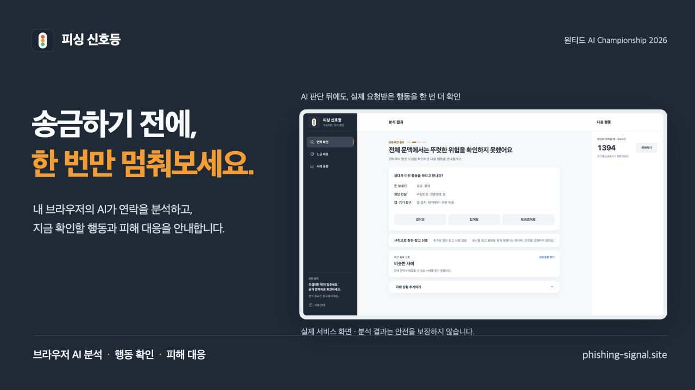
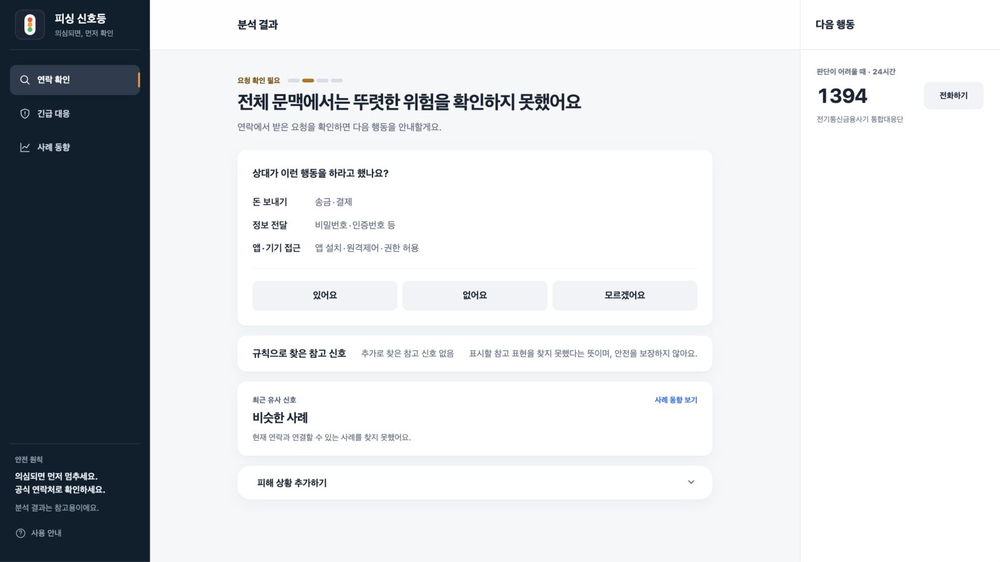
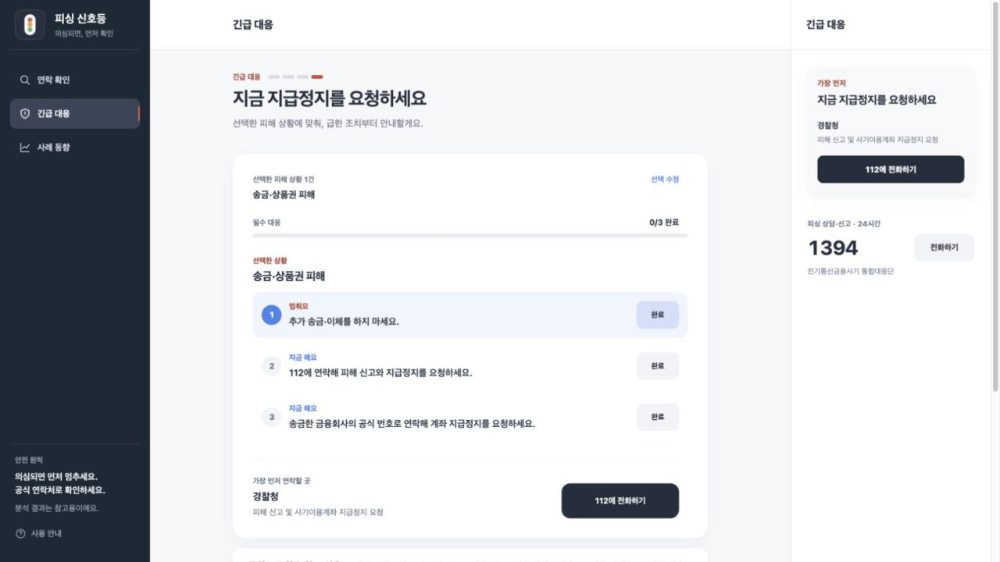
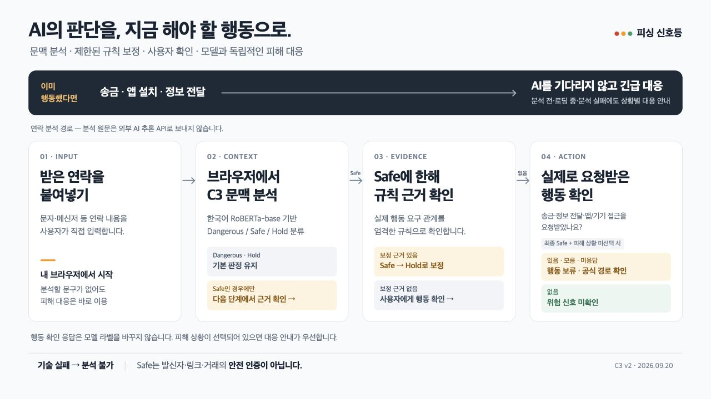

  

# 피싱 신호등

**송금 전 멈춤부터, 피해 후 대응까지.**

수상한 문자·메신저 문구를 붙여넣으면, 내 브라우저에서 AI가 문맥을 분석하고 지금 확인해야 할 행동을 안내합니다. 이미 송금하거나 앱을 설치했다면 분석을 기다리지 않고 피해 대응으로 이동합니다.

**[서비스 체험하기 ↗](https://www.phishing-signal.site/)** · [판단 흐름](docs/architecture.md) · [검증 결과와 한계](docs/evaluation.md) · [연구에서 제품까지](docs/journey.md)

원티드 AI Championship 2026 출품작 · 제작 박건호 · 2026.09.20 기준

## 수상한 연락을 받은 순간, 필요한 것은 다음 행동입니다

“이 문자, 믿어도 될까?”를 검색하는 동안에도 상대는 송금, 인증번호 전달, 앱 설치를 재촉합니다. 연락이 의심스러운지 알아보는 일과, 이미 행동한 뒤 무엇부터 해야 하는지 알아보는 일은 한 흐름으로 이어져야 합니다.

피싱 신호등은 **행동하기 전의 확인과 행동한 뒤의 대응**을 한 화면 흐름으로 연결합니다. 수신 문구를 직접 붙여넣는 웹 서비스이며, 통화 감청·문자 자동 수집·URL 방문 검사를 수행하지 않습니다.

## 세 가지 설계 결정

### 1. 민감한 연락은 내 브라우저에서 분석합니다

한국어 사전학습 모델 **KLUE RoBERTa-base를 피싱 문맥에 맞게 파인튜닝**하고 ONNX로 변환했습니다. 브라우저의 WASM에서 위험·정보 부족·위험 신호 미확인에 해당하는 기본 판정을 만듭니다. 분석 원문을 외부 AI 추론 API로 보내지 않습니다.

첫 실행에는 약 223MB 모델 다운로드가 필요합니다. 앱·모델 다운로드, 사례 조회, 방문 분석 등 네트워크 통신은 있으며 완전 오프라인 서비스는 아닙니다.

### 2. AI가 Safe라고 해도 확인을 끝내지 않습니다

AI가 Safe로 분류한 경우, 실제 위험 행동 관계가 확인된 규칙 근거가 있는지 검사해 **Hold로 보정**할 수 있습니다. 그 이후에도 Safe라면 “돈 보내기·정보 전달·앱 접근을 요청받았나요?”를 묻습니다.

“있어요”, “모르겠어요”, 미응답은 행동 보류로 안내합니다. “없어요”도 발신자나 거래의 안전을 인증하지 않습니다. 이 질문은 모델 라벨과 별개인 사용자 행동 안내입니다.

### 3. 이미 행동했다면 AI보다 대응이 먼저입니다

송금·앱 설치·개인정보 전달 여부에 따라 대응 순서를 안내합니다. 모델이 로딩 중이거나 연락 원문이 없어도 긴급 대응을 사용할 수 있습니다. 분석 실패 역시 Safe로 표시하지 않고 **분석 불가**로 구분합니다.

## AI와 규칙, 사람이 맡는 일이 다릅니다

| 역할 | 맡기는 일 |
|---|---|
| 한국어 문맥 모델 | 입력 문구를 Dangerous / Safe / Hold로 분류 |
| 엄격한 규칙 근거 | 모델 Safe에 명확한 위험 행동 근거가 있으면 Hold로 보완 |
| 화면 참고 표시 | 원문에서 확인할 표현을 보여줌. 모델 내부 판단 이유와 구분 |
| 사용자 행동 확인 | 문구 밖에서 실제로 받은 민감한 행동 요구를 확인 |
| 긴급 대응 | 이미 한 행동에 맞춰 대응 순서 안내. 모델 완료와 독립 |

현재 구조는 C3 중심의 문맥 분류와 Safe 전용 규칙 보정입니다. [상세 구조 보기 →](docs/architecture.md)

## 직접 체험해 보세요

1. [연락 확인](https://www.phishing-signal.site/)에서 **검찰 사칭 예시**를 선택하고 분석합니다. 위험 안내와 원문 참고 표현을 확인합니다.
2. **배송 안내 예시**를 분석합니다. AI 결과 이후에도 민감한 행동을 요청받았는지 묻는 흐름을 확인합니다.
3. [긴급 대응](https://www.phishing-signal.site/?screen=incident)에서 이미 한 행동을 선택합니다. 연락 분석 없이 대응 순서를 확인할 수 있습니다.

화면의 예시는 기능 시연용입니다. 성능 평가 표본으로 사용하지 않습니다. [시연 가이드와 화면 설명 →](docs/demo.md)

## 연구가 제품의 결정으로 이어진 과정

규칙 기반 탐지에서 출발해 한국어 모델과 결합 방식을 비교했습니다. 그 과정에서 **위험 단어가 등장하는 것과 실제 위험 행동을 요구하는 것은 다르다**는 문제, 그리고 제품 입력과 학습 문장의 차이를 확인했습니다.

데이터의 문맥·라벨 기준을 재검토하고 C3 v2를 학습했습니다. 제품에는 모델의 분류 능력과 함께 정보 부족 처리, 제한된 규칙 보정, 행동 질문, 실패 상태, 피해 대응을 남겼습니다. 각 실험에서 발견한 문제와 제품에 반영한 결정은 연구 기록에 정리했습니다. [문제 발견 → 설계 결정 → 현재 제품 →](docs/journey.md)

## 현재 검증 결과와 남은 과제

| 확인한 것 | 해석 범위 |
|---|---|
| 개발 입력 450/450에서 브라우저 실행 판정 일치 | 학습 모델을 웹으로 옮긴 뒤 변환·실행 일치성. 정확도 100%가 아님 |
| 운영 환경 첫 분석 29.94초, 같은 탭 후속 1.01초 | 한 데스크톱 환경의 단일 관측. 모든 기기에서의 속도 보장 아님 |
| 고정 평가 205개 중 165개 정답 | 해당 평가의 80.49%. 실제 수신 연락 전체의 정확도 아님 |

**위험을 놓친 사례가 남아 있으며, 내부 안전 품질 기준은 미달(FAIL)입니다.** 현재 출품 버전은 이를 인지한 제작자의 예외 출시 결정으로 공개했습니다. 실제 피해 감소 효과와 상용 수준의 안전성은 아직 검증되지 않았습니다. 오류 유형·검증 범위·모델 식별자는 [평가 문서](docs/evaluation.md)에 함께 공개합니다.

## 기술 스택

| 영역 | 기술과 역할 |
|---|---|
| 제품 | Next.js 16.3.3 · React 19.2.8 · TypeScript 6.0.3 |
| 모델 | KLUE RoBERTa-base 파인튜닝 · PyTorch · ONNX |
| 브라우저 추론 | ONNX Runtime Web 1.29.0 · WASM · Web Worker |
| 배포 | Vercel — 웹앱 / Cloudflare R2 — 모델 파일 |
| 사례 조회 | Supabase — 현재 제품의 사례 동향 조회 |

요청마다 외부 생성형 AI 추론 API를 호출하지 않는 구조입니다. 모델 배포 비용과 사용자 기기의 다운로드·연산 부담은 남습니다. 현재 새 분석 결과의 사례 공유는 비활성이며, 사용자 입력을 자동으로 학습 데이터로 수집하지 않습니다.

## 개발에 활용한 AI

ChatGPT/Codex를 제품 구현, 회귀 검증, 기록 정리와 문서화에 활용했습니다. 제품에서 사용자의 연락을 분류하는 AI는 별도로 파인튜닝한 RoBERTa 모델이며, 대화형 AI 도구의 응답을 그대로 서비스 판정으로 사용하지 않습니다.

## 다음 검증과 확장

다음 우선순위는 **실제 휴대전화에서의 성능 확인, 첫 다운로드 부담 개선, 독립적인 현장 평가**입니다. 이후 가족이 함께 확인하는 흐름, 상담 현장에서 쓰는 보조 도구 등으로 확장할 수 있는지 검증하려 합니다. 이는 현재 제공 기능이나 확보된 사용자 성과가 아닌 향후 계획입니다.

## 이 공개 저장소에 담긴 것

이곳은 제품 소개, 설계 설명, 평가 집계, 실제 화면을 선별한 **심사용 공개 자료 저장소**입니다. 운영 코드·연구 원문·학습 및 평가 데이터·모델 바이너리·비공개 Git 이력은 포함하지 않습니다. 따라서 전체 학습·평가를 재현하는 오픈소스 배포를 의미하지 않습니다.

- [제품 판단 구조](docs/architecture.md)
- [평가 결과·실행물 식별·알려진 한계](docs/evaluation.md)
- [연구에서 제품으로 이어진 결정](docs/journey.md)
- [직접 체험할 시연 가이드](docs/demo.md)
- [모델·기술 출처와 라이선스](docs/attribution.md)

연락 분석은 참고 정보입니다. 금전·인증정보·앱 설치를 요구받았다면 상대가 제공한 경로와 별개로 알고 있던 공식 경로에서 확인하세요.
