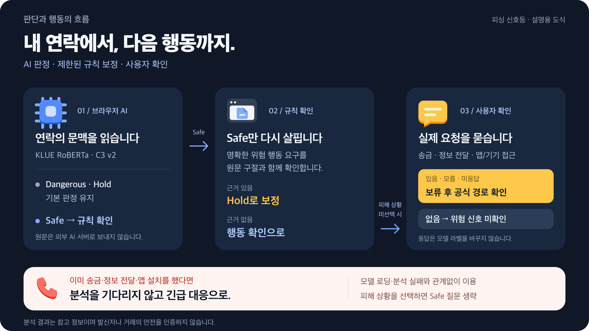

# 피싱 신호등

**AI가 위험을 찾지 못해도 송금 전에는 한 번 더 묻습니다.**

받은 문자·메시지를 브라우저에서 분석하는 피싱 대응 서비스입니다.<br/>
송금·정보 전달·앱 설치를 요구받았는지 사용자에게 다시 확인합니다.<br/>
이미 행동했다면 AI 분석을 기다리지 않고 피해 대응 방법부터 안내합니다.

**1인 개발** · 기획 · UI 설계 · 모델 학습 · 웹 구현 · 배포

**[직접 체험하기 ↗](https://www.phishing-signal.site/)** · [판단과 행동의 흐름](docs/architecture.md) · [검증 결과와 한계](docs/evaluation.md) · [연구에서 제품까지](docs/journey.md)

<br>

> **분석 방식과 첫 실행 안내**<br/>
> 입력한 문자·메시지는 외부 AI 서버로 보내지 않고 사용자의 브라우저에서 분석합니다.<br/>
> 첫 분석에는 약 **223MB 모델 다운로드와 준비 시간**이 필요하며 기기와 네트워크에 따라 시간이 달라집니다.<br/>
> 같은 탭에서 다시 분석할 때는 준비된 모델을 재사용합니다.


[체험 순서와 예시 문구 ↓](#직접-체험해-보세요)

<hr>

<p align="center">
  <picture>
    <source media="(prefers-reduced-motion: reduce)" srcset="assets/cover.png" />
    
  </picture>
</p>

<br>
<br>

## 이 장면부터 확인해 주세요

피해 상황을 선택하지 않고 **배송 안내 예시**를 분석하면 최종 결과가 Safe일 때 다음 질문이 나타납니다.

<br>

> 상대가 이런 행동을 하라고 했나요? <br>
> 돈 보내기 · 정보 전달 · 앱/기기 접근

<br>

**“모르겠어요”를 선택하면 행동을 보류하고 공식 경로로 확인하도록 안내합니다.**<br/>
문구 분석만으로 알 수 없는 실제 요청은 사용자가 직접 확인합니다.<br/>
답을 골라도 모델 라벨은 바뀌지 않습니다.



배송 안내 시연의 동작을 요약한 도식입니다.<br/>
실제 화면: [행동 확인 질문](assets/03-action-check.png) · [모르겠어요 선택 후 안내](assets/04-action-hold.png)

이미 송금하거나 앱을 설치했다면 **긴급 대응**에서 현재 상황을 선택합니다.<br/>
원문 입력이나 AI 분석 완료 없이 대응 순서를 확인할 수 있습니다.

<br>
<br>

## 세 가지 설계 결정

### 1. Safe 이후에도 실제 행동 요구를 확인합니다

한국어 문맥 모델이 Safe로 분류한 입력만 엄격한 규칙으로 다시 살피고 근거가 있으면 Hold로 보정합니다.<br/>
그래도 Safe라면 실제 행동 요구를 사용자에게 묻습니다.<br/>
“있어요”, “모르겠어요”, 미응답이면 행동 보류를 안내하고 “없어요”를 고르면 위험 신호 미확인으로 표시합니다.<br/>
발신자나 거래의 안전을 인증하는 결과는 아닙니다.

<br>

### 2. 이미 행동했다면 AI보다 대응이 먼저입니다

송금·앱 설치·개인정보 전달 여부에 따라 대응 순서를 안내합니다.<br/>
모델이 로딩 중이거나 연락 원문이 없어도 이용할 수 있으며 분석 실패도 별도의 “분석 불가”로 구분합니다.

<br>

### 3. 민감한 연락은 내 브라우저에서 분석합니다

KLUE RoBERTa-base를 피싱 문맥에 맞게 파인튜닝하고 ONNX로 변환해 브라우저에서 실행합니다.<br/>
분석 원문을 외부 AI 추론 API로 보내지 않습니다.<br/>
첫 실행에는 약 223MB 모델 다운로드가 필요하며 모델 다운로드·사례 조회·방문 분석 등 네트워크 통신은 있습니다.

<br>
<br>

## AI와 규칙, 사람이 맡는 일이 다릅니다



[흐름도 확대 보기: 벡터 SVG](assets/flow.svg) · [3200×1800 PNG](assets/flow.png)

| 역할 | 맡기는 일 |
|---|---|
| 한국어 문맥 모델 | 입력 문구를 Dangerous / Safe / Hold로 분류 |
| 엄격한 규칙 근거 | 모델 Safe에 명확한 위험 행동 근거가 있으면 Hold로 보완 |
| 화면 참고 표시 | 원문에서 확인할 표현을 보여줌. 모델 내부 판단 이유와 구분 |
| 사용자 행동 확인 | 실제로 송금·정보 전달·앱 설치를 요구받았는지 사용자에게 확인 |
| 긴급 대응 | 분석 완료를 기다리지 않고 이미 한 행동에 맞춰 대응 순서 안내 |

[판정 조건과 예외 처리까지 포함한 상세 구조 →](docs/architecture.md)

<br>
<br>

## 직접 체험해 보세요

[연락 확인](https://www.phishing-signal.site/)에서 화면의 예시 버튼을 선택하거나 아래 문구를 붙여넣고 **위험 신호 확인하기**를 누릅니다.<br/>
예시 버튼이 보이지 않는 화면에서도 같은 문구로 체험할 수 있습니다.

**1. 검찰 사칭 — 위험한 요구를 확인합니다.**

```text
서울중앙지검 금융수사팀입니다. 자산 보호를 위해 지금 안전계좌로 송금하고 OTP 인증번호를 알려주세요.
```

위험 안내와 원문에서 다시 확인할 참고 표현을 살펴봅니다.

<br>

**2. 배송 안내 — AI 판정 이후의 행동 확인을 봅니다.**

```text
배송이 완료되었습니다. 자세한 배송 내역은 택배사 공식 앱에서 확인해 주세요.
```

피해 상황을 선택하지 않은 상태에서 분석한 뒤 **모르겠어요**를 선택합니다.<br/>
송금·정보 전달·앱 설치를 보류하고 공식 경로로 확인하도록 안내하는 흐름을 볼 수 있습니다.

<br>

**3. [긴급 대응](https://www.phishing-signal.site/?screen=incident) — 연락 분석 없이 대응 순서를 확인합니다.**

이미 한 행동을 선택하고 **대응 보기**를 누릅니다.<br/>
시연 중 실제 전화·신고 버튼을 누를 필요는 없습니다.

위 문구는 제품에 넣어 둔 합성 예시이며 성능 평가 표본이 아닙니다.<br/>
[시연 가이드·실제 화면·측정 조건 →](docs/demo.md)


<br>
<br>

## 연구가 제품의 결정으로 이어진 과정

규칙 기반 탐지부터 시작해 여러 한국어 모델과 결합 방식을 비교했습니다.<br/>
**위험 단어가 등장하는 것과 실제 위험 행동을 요구하는 것은 다르다**는 문제도 이 과정에서 확인했습니다.<br/>
사용자가 붙여 넣을 연락과 설명·보고 형식의 학습 문장을 구분할 필요도 있었습니다.

<br>

데이터의 문맥과 라벨 기준을 다시 보고 C3 v2를 학습했습니다.<br/>
모델 판정에 제한된 규칙 보정과 행동 질문을 연결하고 정보 부족·분석 실패·피해 대응을 구분해 처리했습니다.<br/>
[데이터·모델·제품 구성을 바꾼 과정 →](docs/journey.md)

<br>

구현에서도 **분석이 끝나기 전에 긴급 대응을 이용할 수 있어야 한다**는 조건을 두었습니다.<br/>
모델 준비·추론은 Worker로 옮기고 대응 화면은 분석 결과와 별도로 동작하게 했습니다.<br/>
[문제·선택·확인 결과를 정리한 구현 사례 →](docs/journey.md#구현-사례-ai를-기다리지-않는-긴급-대응)

<br>
<br>

## 검증 결과와 한계

아래 수치는 **2026년 9월 20일 출시 버전**을 기준으로 합니다.

| 확인한 결과 | 해석 범위 |
|---|---|
| 개발 입력 450/450에서 브라우저 실행 판정 일치 | 모델 변환·실행의 일치성 검사이며 피싱 탐지 정확도 100%를 뜻하지 않습니다. |
| 첫 분석 29.94초 · 같은 탭 후속 분석 1.01초 | 한 데스크톱 환경에서 측정한 단일 관측값입니다. |
| 고정 평가 205개 중 165개 정답 · 80.49% | 해당 평가에서의 결과이며 실제 수신 연락 전체의 정확도로 일반화할 수 없습니다. |

현재 피싱 판정 성능은 내부 안전 기준을 아직 충족하지 못했으며 위험 문구를 놓치는 사례가 남아 있습니다.

[평가 조건·오류 유형·모델 식별자 자세히 보기 →](docs/evaluation.md)

<br>
<br>

## 기술 스택

| 영역 | 기술과 역할 |
|---|---|
| 제품 | Next.js 16.3.3 · React 19.2.8 · TypeScript 6.0.3 |
| 모델 | KLUE RoBERTa-base 파인튜닝 · PyTorch · ONNX |
| 브라우저 추론 | ONNX Runtime Web 1.29.0 · WASM · Web Worker |
| 배포 | Vercel — 웹앱 / Cloudflare R2 — 모델 파일 |
| 사례 조회 | Supabase — 현재 제품의 사례 동향 조회 |

모델 배포 비용과 사용자 기기의 다운로드·연산 부담은 남습니다.<br/>
현재 새 분석 결과의 사례 공유는 꺼져 있고 사용자 입력을 학습 데이터로 자동 수집하지 않습니다.

<br>
<br>

## 개발에 활용한 AI

ChatGPT/Codex는 제품 구현, 회귀 검증, 기록 정리, 문서화에 사용했습니다.<br/>
표지는 ChatGPT의 이미지 생성 기능으로 편집했습니다.<br/>
사용자의 연락을 분류하는 AI는 별도로 파인튜닝한 RoBERTa 모델입니다.<br/>
대화형 AI의 답변을 서비스 판정으로 그대로 쓰지 않습니다.

<br>
<br>

## 다음 검증과 확장

이제 **실제 휴대전화 성능, 첫 다운로드 부담, 독립적인 현장 평가**를 확인해야 합니다.<br/>
가족이 함께 확인하는 흐름이나 상담 현장 보조 도구로 넓힐 수 있는지도 살펴볼 계획입니다.<br/>
아직 제공하는 기능이나 확인된 사용자 성과는 아닙니다.

<br>
<br>

## 이 공개 저장소에 담긴 것

이 저장소에는 제품 소개, 설계 설명, 평가 집계, 실제 화면만 담았습니다.<br/>
운영 코드·연구 원문·학습 및 평가 데이터·모델 바이너리·비공개 Git 이력은 없습니다.<br/>
전체 학습·평가를 재현할 수 있는 오픈소스 배포판은 아닙니다.

- [제품 판단 구조](docs/architecture.md)
- [평가 결과·실행물 식별·알려진 한계](docs/evaluation.md)
- [연구에서 제품으로 이어진 결정](docs/journey.md)
- [직접 체험할 시연 가이드](docs/demo.md)
- [모델·기술 출처와 라이선스](docs/attribution.md)

연락 분석은 참고 정보입니다.<br/>
금전·인증정보·앱 설치를 요구받았다면 상대가 제공한 경로와 별개로 알고 있던 공식 경로에서 확인하세요.
