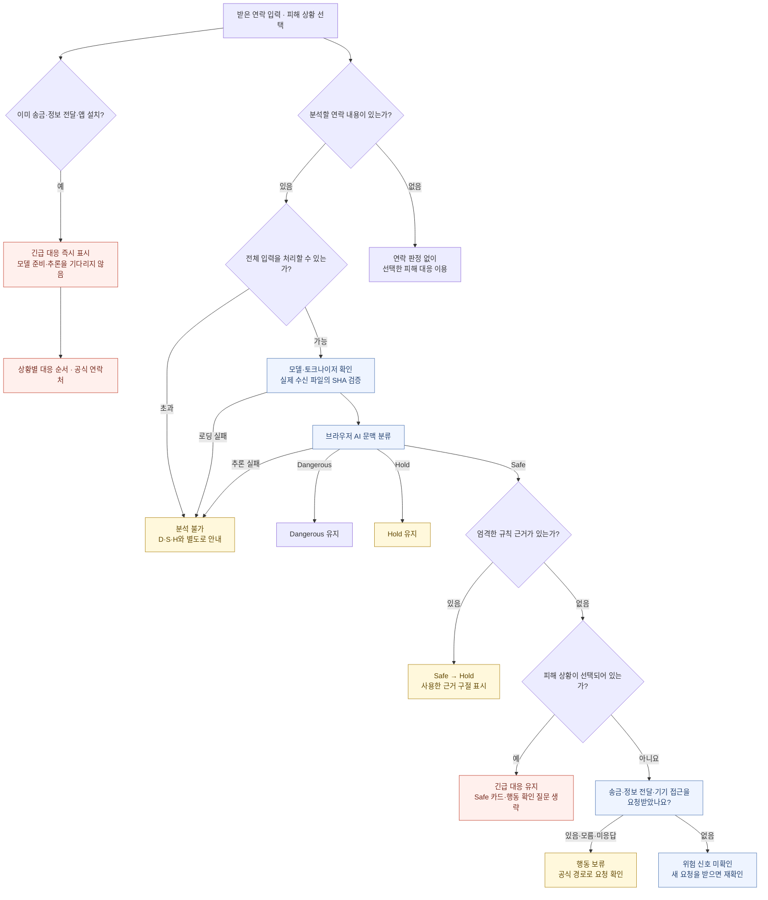

# 피싱 신호등은 어떻게 판단하고 행동을 안내하나요?

피싱 신호등은 받은 연락에서 위험 신호를 찾고, 지금 해야 할 일까지 안내합니다.
AI가 뚜렷한 위험을 찾지 못하면 규칙과 사용자 확인으로 민감한 행동 요구를 다시 살핍니다.
이미 돈을 보내거나 정보를 전달했다면 AI 분석을 기다리지 않고 피해 대응부터 안내합니다.

[실제 서비스 열기](https://www.phishing-signal.site/) · [검증 결과와 한계](evaluation.md) · [기반 모델·라이선스](attribution.md)

이 저장소는 피싱 신호등을 소개하는 공개 자료입니다. 운영 애플리케이션 소스, 학습 원문, 비공개 평가 데이터는 담지 않았습니다. 아래 내용은 2026년 9월 20일 운영 모델과 제품 동작을 기준으로 정리했습니다.

 
 

## 1. AI 판정에서 다음 행동까지

피해 대응 경로와 연락 분석 경로는 별도로 동작합니다. 피해가 선택된 상태에서는 Dangerous·Hold·분석 실패 여부와 관계없이 대응 안내가 우선합니다. 연락 원문이 없어도 피해 상황을 선택하면 대응 안내를 이용할 수 있습니다.

 
 

## 2. 혼동하지 않도록 분리한 네 가지 역할

| 역할 | 하는 일 | 제품 판정에 미치는 영향 |
|---|---|---|
| **AI 모델** | 한국어 연락의 문맥을 Dangerous / Safe / Hold로 분류합니다. | 기본 라벨을 결정합니다. Safe는 발신자·링크·거래의 안전 인증이 아닙니다. |
| **엄격한 보정 근거** | AI가 Safe로 분류했을 때, 실제 행동 요구와 관련된 규칙 근거를 원문 구절에 연결해 확인합니다. | 근거가 있으면 **Safe만 Hold로 보정**합니다. Dangerous와 Hold는 그대로 유지합니다. |
| **규칙으로 찾은 참고 표시** | 본문에서 찾은 관련 표현을 사용자가 다시 읽을 수 있게 표시합니다. | 화면 참고용입니다. 표시 자체가 모델 라벨이나 최종 판정을 변경하지 않습니다. |
| **사용자 행동 확인** | 최종 Safe이고 피해 상황이 없는 경우, 송금·정보 전달·앱 설치·원격제어 등의 요청을 받았는지 묻습니다. | 모델 라벨을 수정하지 않고 다음 행동을 안내합니다. 있음·모름·미응답은 행동 보류입니다. |

보정 근거는 인증정보 전달, 민감한 기기 접근, 앱 설치, 자금 이동, 민감서류 전달, 사건을 이유로 한 유도 등의 관계를 살핍니다. 단어가 나왔다는 이유만으로 모든 구절을 보정 근거로 삼지는 않습니다. 요청의 대상·목적·역할을 확인할 문맥이 부족할 때도 그 근거를 함께 안내합니다.

화면에서는 **‘요청 확인에 사용한 근거’**와 **‘규칙으로 찾은 참고 신호’**를 구분합니다. 둘 다 AI 모델 내부의 판단 이유를 설명하는 기능은 아닙니다. 참고 표현이 없다는 사실 역시 안전을 보장하지 않습니다.

사용자 확인에서 ‘없어요’를 선택해도 결과는 ‘안전’ 인증이 아닌 **‘위험 신호 미확인’**입니다. 새로운 송금·정보 전달·앱 설치 요구가 생기면 다시 확인하도록 안내합니다. 새 분석을 시작하면 이전 행동 응답은 미응답으로 초기화됩니다.

 
 

## 3. 브라우저 추론과 실패 처리

운영 모델은 **KLUE RoBERTa base를 추가 학습한 c3_v2 base epoch3**입니다. ONNX 파일은 학습 가중치를 FP16으로 저장하고 연산은 FP32로 수행합니다. ONNX Runtime Web의 WASM과 Worker를 사용하며, 서버의 생성형 AI API에 분석 내용을 보내는 방식은 아닙니다.

| 항목 | 운영 계약 |
|---|---|
| 출력 | Dangerous / Safe / Hold의 3개 라벨 |
| 모델 SHA-256 | `7f79f78cb50026a422911e99ddda24b2975845e22d94dbc04d2d999099107e9c` |
| ONNX 크기 | 222,877,586 bytes, 약 222.9MB |
| 토크나이저 SHA-256 | `cc02cedb56df2e4d3bb6b5478cef6aa0daa98930c96b46976c8acdd2432459a8` |
| 입력 정규화 | NFC 및 고정 WordPiece 토크나이저 계약 |
| 입력 길이 | 특수 토큰을 포함해 최대 **256토큰** |
| 무결성 확인 | 다운로드한 실제 bytes의 SHA-256 확인, 모델 파일의 크기도 확인 |
| 실행 위치 | 사용자의 브라우저, WASM Worker |

**256토큰은 256글자가 아닙니다.** 한국어 어절과 기호가 여러 토큰으로 나뉠 수 있습니다. 제품은 입력이 토큰 한도를 넘으면 앞부분만 잘라 판정하지 않고 ‘입력 전체를 분석하지 못했어요’라고 안내합니다. 20,000자 입력 상한도 별도로 적용합니다. 토큰 길이는 큰 모델을 다운로드하기 전에 확인합니다.

다운로드·해시 확인·추론이 실패하거나 모델 출력 형식이 맞지 않으면 **분석 불가**로 처리합니다. 기술적 실패를 Hold나 Safe 판정으로 바꾸지 않습니다. 이미 선택한 피해 대응은 계속 이용할 수 있습니다.

최초 분석에는 모델 다운로드와 준비 시간이 필요합니다. 같은 탭의 후속 분석은 준비된 runtime을 재사용합니다. 측정 조건과 실제 cold/warm 시간, 변환 일치 검증 및 모델의 오판 한계는 [검증 결과](evaluation.md)에서 구분해 공개합니다.

 
 

## 4. 네트워크와 개인정보 처리의 범위

| 데이터·통신 | 현재 제품의 처리 |
|---|---|
| 사용자가 붙여넣은 연락 내용 | 브라우저에서 분석합니다. 기본 분석 경로는 원문을 서버 추론 API로 전송하지 않습니다. |
| ‘있어요 / 없어요 / 모르겠어요’ 응답 | 기본 제품에서는 현재 화면 상태로만 유지합니다. 응답 수집용 서버 전송이나 시험용 영속 기록을 만들지 않습니다. |
| 모델·토크나이저·실행 파일 | 네트워크로 내려받습니다. 모델은 Cloudflare R2 기반 도메인에서 제공합니다. |
| 사례 동향 | Supabase를 통해 사례를 조회합니다. 현재 운영 모델의 새 분석 결과를 사례로 공유하는 기능은 비활성입니다. |
| 서비스 이용 통계 | Vercel Analytics를 사용합니다. 서비스 전체에 서버 통신이나 통계 수집이 없다고 설명하지 않습니다. |
| 결과에 표시하는 구절 | 인증번호·비밀번호·계좌 등 정형 민감정보를 가리고 URL·이메일 표시도 보호합니다. 원문 입력란과 모델 입력을 완전히 익명화하는 기능은 아닙니다. |

표시 보호는 알려진 패턴을 대상으로 합니다. 자유 서술에 포함된 모든 이름·주소를 판별하는 완전한 익명화 기능이 아니며, 서비스 전체가 완전 오프라인으로 동작한다고 주장하지 않습니다.

 
 

## 5. 기술 구성

| 영역 | 기술 | 역할 |
|---|---|---|
| 웹 애플리케이션 | Next.js 16.3.3 · React 19.2.8 | 입력, 분석 결과, 행동 확인, 긴급 대응 화면 |
| 구현 언어·런타임 | TypeScript 6.0.3 · Node.js 22.x | 제품 로직과 웹 애플리케이션 실행 |
| 문맥 분류 | KLUE RoBERTa base 기반 추가 학습 모델 | 피싱 연락의 3분류 |
| 학습·변환 | PyTorch · Transformers · ONNX | 추가 학습과 브라우저 실행물 변환 |
| 브라우저 추론 | ONNX Runtime Web 1.29.0 · WASM · Worker | 로컬 모델 실행, UI와 계산 분리 |
| 입력·계약 검증 | Zod 4.4.3 및 TypeScript 검증 로직 | 데이터 형식과 제품 경계 확인 |
| 사례 조회 | Supabase JS 2.112.4 | 사례 동향 데이터 접근 |
| 배포·모델 전달 | Vercel · Cloudflare R2 | 웹 서비스 배포와 모델 파일 제공 |
| 이용 통계 | Vercel Analytics 2.0.1 | 서비스 이용 통계 |

모델의 기반 출처와 가중치 라이선스는 [출처·라이선스 고지](attribution.md)를 따릅니다. 제품 동작 검증, 실행물 변환 일치, 모델 정답률은 서로 다른 검증이며 [평가 문서](evaluation.md)에서 구분합니다.
