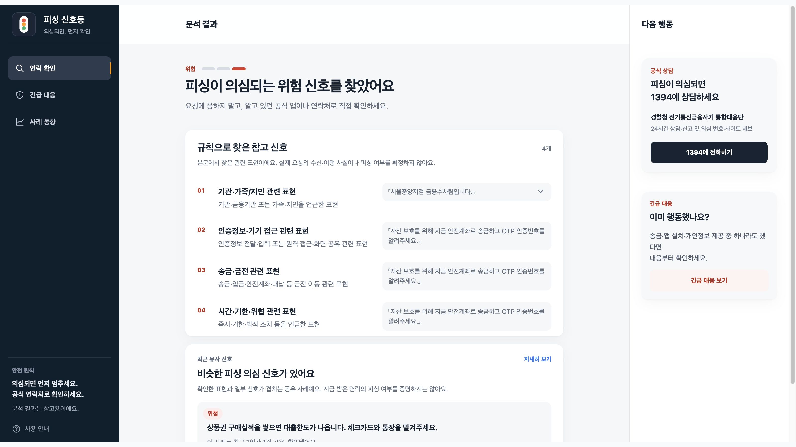
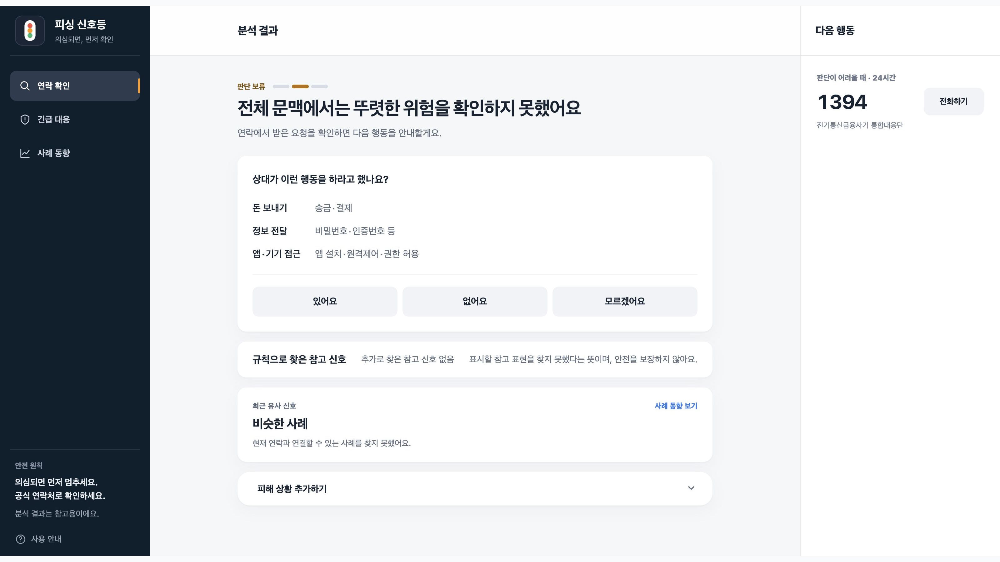
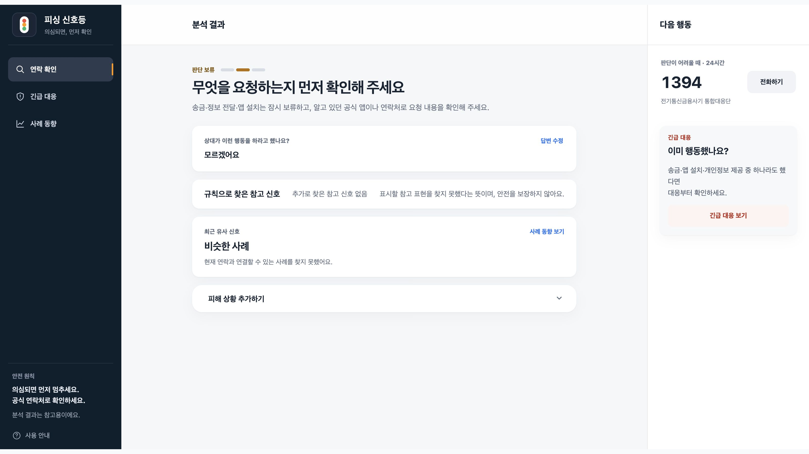
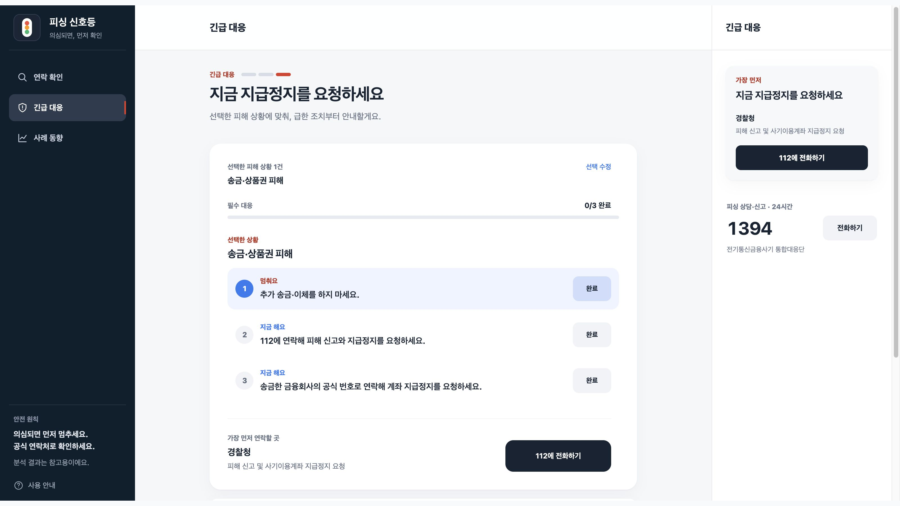

# 직접 체험하기

[← 제품 소개](../README.md) · [서비스 열기](https://www.phishing-signal.site/)

가입 없이 웹에서 체험할 수 있습니다. 첫 분석에는 약 223MB 모델을 다운로드하므로 네트워크와 기기에 따라 시간이 걸립니다. 9월 20일 한 데스크톱 환경에서는 첫 분석 약 30초, 같은 탭 후속 분석 약 1초가 관측됐습니다. 모든 환경의 속도를 보장하지 않습니다.

## 1. 위험한 요구 확인

연락 확인 화면의 **검찰 사칭 예시**를 선택하고 **위험 신호 확인하기**를 누릅니다.

> 서울중앙지검 금융수사팀입니다. 자산 보호를 위해 지금 안전계좌로 송금하고 OTP 인증번호를 알려주세요.

이 문구는 제품에 내장된 합성 예시입니다. 실존 연락을 수집한 자료가 아닙니다. 출품 화면 촬영에서 위험 안내와 규칙으로 찾은 참고 표현을 확인했습니다. 참고 표현은 모델 내부의 판단 이유를 설명하는 자료가 아닙니다.

## 2. 뚜렷한 위험이 없어도 행동 확인

다시 연락 확인으로 돌아가 **배송 안내 예시**를 분석합니다.

> 배송이 완료되었습니다. 자세한 배송 내역은 택배사 공식 앱에서 확인해 주세요.

촬영에서는 모델 Safe 이후 **송금·정보 전달·앱 접근 요구를 받았는지** 추가 질문이 나타났습니다. “모르겠어요”를 선택하면 행동을 보류하고 공식 경로에서 확인하도록 안내합니다. 모델 라벨을 새로 예측하는 절차는 아닙니다.

## 3. 연락 분석 없이 긴급 대응

[긴급 대응](https://www.phishing-signal.site/?screen=incident)에서 “돈을 보내거나 상품권 코드를 알려줬어요”를 선택하고 **선택한 1건 대응 보기**를 누릅니다. 선택한 상황에 따른 대응 순서를 볼 수 있습니다. 시연 중에는 실제 전화·신고 버튼을 누를 필요가 없습니다.

## 촬영과 검증 범위

- 촬영: 2026.09.20, 공개 운영 서비스, 데스크톱 Chromium에서 실제 페이지의 1600×900 배치를 2배로 렌더링했습니다. 제출 출력은 모두 3200×1800(16:9) PNG입니다.
- 내장 합성 예시와 시연용 피해 상황 선택만 사용했습니다. 개인의 실제 연락·피해 정보는 포함하지 않았습니다.
- 결과 문구를 편집하거나 미구현 기능을 덧그리지 않았습니다. 캡처 도구가 제외한 가장자리만 바깥 여백으로 채워 16:9 비율을 맞췄습니다. 원본 캡처 픽셀은 리사이즈·색 보정 없이 보존했습니다.
- 대표 이미지는 실제 서비스의 행동 확인 화면입니다. 판단 흐름 이미지는 홈페이지의 실제 CSS 색상·글꼴·모서리 값과 브랜드 마크를 재사용한 설명용 도식이며, 벡터 SVG와 3200×1800 PNG를 제공합니다.
- 이 시연은 알려진 예시의 기능 확인입니다. 독립 성능 평가나 실사용자 피해 예방 효과의 증거가 아닙니다.
- 휴대전화 실기기 성능 검증은 포함하지 않습니다.
