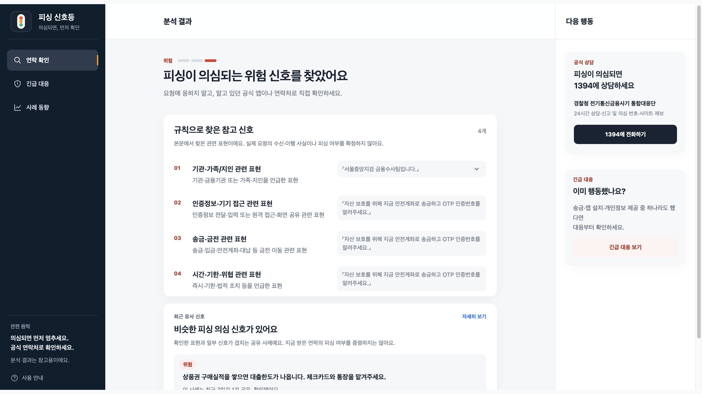
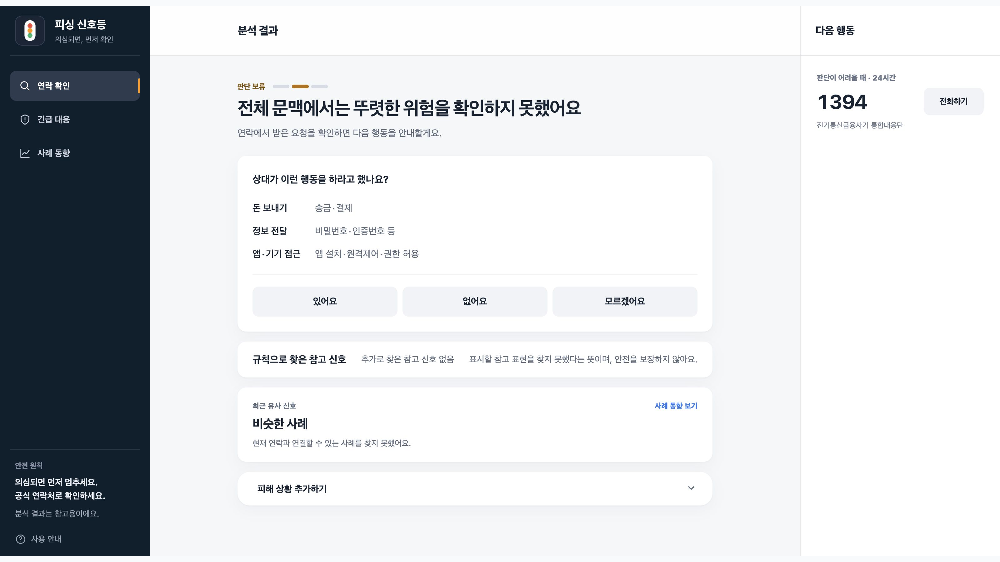
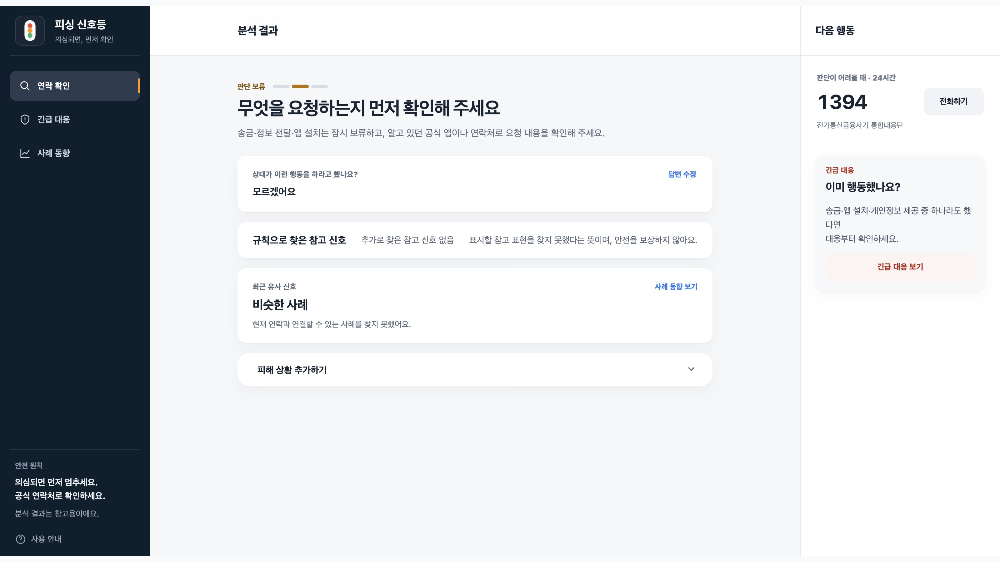
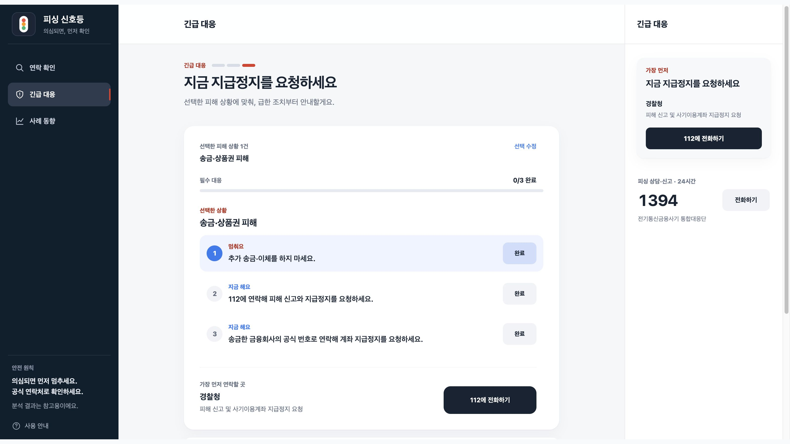

# 직접 체험하기

[← 제품 소개](../README.md) · [연락 확인 열기](https://www.phishing-signal.site/check)

가입 없이 웹에서 체험할 수 있습니다.<br/>
첫 분석에는 약 223MB 모델을 다운로드하므로 네트워크와 기기에 따라 시간이 걸립니다.<br/>
9월 20일 한 데스크톱 환경에서는 첫 분석 약 30초, 같은 탭 후속 분석 약 1초가 관측됐습니다.<br/>
걸리는 시간은 사용 환경에 따라 달라집니다.

홈페이지 첫 화면은 [서비스 소개](https://www.phishing-signal.site/)입니다. 원문의 처리 범위와 필요한 통신은 [신뢰와 데이터](https://www.phishing-signal.site/trust)에서 확인할 수 있습니다.

메인 페이지의 짧은 인트로와 연락 확인의 사용 안내는 별개입니다. 연락 확인에 처음 들어가면 사용 안내가 열립니다. 안내를 마치거나 건너뛰면 브라우저에 기록을 남기고 이후에는 필요할 때 직접 다시 열 수 있습니다. [긴급 대응](https://www.phishing-signal.site/check?screen=incident)으로 바로 들어가면 안내를 거치지 않습니다.

<br>
<br>

## 1. 위험한 요구 확인

연락 확인 화면에서 **검찰 사칭 예시**를 선택한 뒤 **위험 신호 확인하기**를 누릅니다.<br/>
화면 너비에 따라 예시 버튼이 보이지 않을 때는 아래 문구를 입력란에 붙여넣어 분석할 수 있습니다.

```text
서울중앙지검 금융수사팀입니다. 자산 보호를 위해 지금 안전계좌로 송금하고 OTP 인증번호를 알려주세요.
```

이 문구는 제품에 넣어 둔 합성 예시이며 실제 연락을 수집한 자료가 아닙니다.<br/>
촬영 화면에서 위험 안내와 규칙으로 찾은 참고 표현을 확인했습니다.<br/>
참고 표현은 모델 내부의 판단 이유를 설명하지 않습니다.



<br>
<br>

## 2. 뚜렷한 위험이 없어도 행동 확인

피해 상황을 선택하지 않은 상태에서 다시 연락 확인으로 돌아갑니다.<br/>
**배송 안내 예시**를 선택하거나 아래 문구를 붙여넣고 분석합니다.

```text
배송이 완료되었습니다. 자세한 배송 내역은 택배사 공식 앱에서 확인해 주세요.
```

촬영한 화면에는 모델의 Safe 판정 뒤에 **송금·정보 전달·앱 접근 요구를 받았는지** 묻는 질문이 나타납니다.<br/>
“모르겠어요”를 선택하면 행동을 보류하고 공식 경로에서 확인하도록 안내합니다.<br/>
이 답으로 모델 라벨을 새로 예측하지는 않습니다.





<br>
<br>

## 3. 연락 분석 없이 긴급 대응

[긴급 대응](https://www.phishing-signal.site/check?screen=incident)에서 “돈을 보내거나 상품권 코드를 알려줬어요”를 선택하고 **선택한 1건 대응 보기**를 누릅니다.<br/>
선택한 상황에 따른 대응 순서를 볼 수 있습니다.<br/>
시연 중에는 실제 전화·신고 버튼을 누를 필요가 없습니다.



<br>
<br>

## 촬영과 검증 범위

### 실제 운영 화면 캡처

이 가이드의 실제 화면 캡처는 2026년 9월 20일 기록입니다. 2026년 10월 10일까지 바뀐 서비스 소개·신뢰 화면과 첫 방문 안내는 담지 않았습니다. 현재 화면 구성은 [화면 설계 문서](branding.md)에 따로 정리했습니다.

- 촬영: 2026.09.20, 공개 운영 서비스, 데스크톱 Chromium에서 실제 페이지의 1600×900 배치를 2배로 렌더링했습니다.<br/>
  제출 출력은 모두 3200×1800(16:9) PNG입니다.<br/><br/>
- 내장 합성 예시와 시연용 피해 상황 선택만 사용했습니다.<br/>
  개인의 실제 연락·피해 정보는 포함하지 않았습니다.<br/><br/>
- 결과 문구를 편집하거나 미구현 기능을 덧그리지 않았습니다.<br/>
  캡처 도구가 제외한 가장자리만 바깥 여백으로 채워 16:9 비율을 맞췄습니다.<br/>
  원본 캡처 픽셀은 리사이즈·색 보정 없이 보존했습니다.<br/><br/>
- assets에 보관한 화면 5장(`01`부터 `05`까지)은 실제 운영 화면 캡처입니다.

<br>

### 표지와 설명용 도식

- README 표지는 기존 브랜드 이미지와 문구를 유지하고, 오른쪽 신호등이 한 바퀴 도는 SVG 모션을 더했습니다. GitHub에서는 스크롤 연동 대신 자동 재생하며, 모션 감소 설정에서는 원래 PNG를 표시합니다.
- 2026년 10월 10일, 행동 확인 도식을 서비스 소개·신뢰 화면의 색상과 입체 아이콘에 맞춰 다시 정리했습니다.<br/><br/>
- README의 [행동 확인 요약](../assets/action-check.svg)은 설명용 도식입니다. 질문과 응답 후 안내를 크게 읽을 수 있도록 정리했습니다.<br/>
  ‘모르겠어요’를 강조한 뒤 화살표가 왼쪽에서 오른쪽으로 채워집니다. 이어서 행동 보류, 제목, 설명이 차례로 반응합니다. 기기의 모션 감소 설정에서는 정지 상태로 읽을 수 있습니다.<br/>
  실제 운영 화면은 위의 PNG로 보존했습니다.

- [판단과 행동의 흐름](../assets/decision-flow.svg)은 브라우저 AI, Safe에 한정한 규칙 확인, 사용자 행동 확인을 순서대로 강조하는 SVG입니다. 카드 안의 여백을 늘리고 별도로 이용하는 긴급 대응은 아래에 작게 배치했습니다.<br/>
  실제 분석 결과를 재생하는 영상은 아닙니다. 모션 감소 설정에서는 움직임 없이 모든 설명을 읽을 수 있습니다.

<br>

### 검증 범위

- 이 시연은 알려진 예시의 기능 확인입니다.<br/>
  독립 성능 평가나 실사용자 피해 예방 효과의 증거가 아닙니다.<br/><br/>
- 휴대전화 실기기 성능 검증은 포함하지 않습니다.
